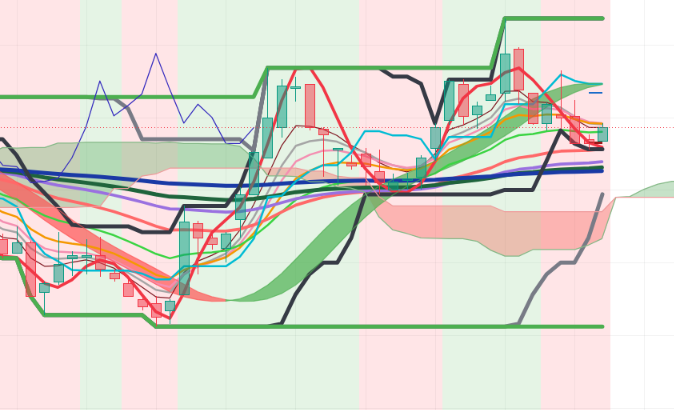

# Pine-Script-Indicators-Needed-Suite
All-in-one comprehensive technical analysis overlay consolidating a 10-EMA ribbon (5–180), fast HMA (9), MACD momentum zone background tinting, triple Donchian Price Channels (9, 26, 52), complete Ichimoku Kinko Hyo cloud, higher-timeframe Hull Suite (240m), and dynamic 1H/1D session open anchors into a single TradingView script.
--
## Chart Preview

--
## Motivation & Problem
- **TradingView Indicator Limits & Fragmented Chart Setups**: Standard TradingView plans impose strict limitations on the number of simultaneous active indicators. Traders who rely on multiple confirmation tools (ribbons, clouds, channels, oscillators, and session levels) are forced to compromise or juggle multiple cluttered scripts.
- **The Core Goal**: To engineer an all-in-one unified indicator suite ("Indicators Needed") that consolidates seven essential technical systems into a single overlay—drastically saving indicator slots, optimizing chart rendering, and providing instant visual alignment across macro and micro trends.
--
## Strategy Logic & Architecture
- This indicator eliminates chart clutter and indicator slot limits by utilizing a **modular, multi-system overlay architecture**:
### Core Components:
1. **10-Period EMA Ribbon (Lengths 5 to 180)**:
  - Deploys 10 customized Exponential Moving Averages (lengths 5, 7, 9, 12, 20, 30, 36, 60, 90, 180) with distinct color assignments and progressive line thicknesses (from 1 to 4).
  - Visualizes short-term momentum cascades, intermediate support/resistance curves, and long-term macro trend baselines in real time.
  - Includes a global display toggle ('PlotEMA1to10') and an optional EMA 30 visibility switch ('plot30').
2. **Fast HMA & MACD Momentum Zone Background ('bgcolor')**:
  - **Fast HMA (Period 9)**: Plots a responsive 9-period Hull Moving Average (linewidth 3, red) for instant detection of local swing curvature.
  - **MACD Zone Tinting**: Computes a fast MACD (Fast 7, Slow 26, Signal 9) that dynamically tints the entire chart background green during bullish momentum ('MACD_macd > MACD_signal') and red during bearish momentum ('MACD_macd < MACD_signal').
3. **Hierarchical Triple Price Channels (9, 26, 52)**:
  - Nests three classical Donchian Price Channels:
    - **PC 1 (Short-Term - Period 9)**: 9-period high/low boundaries (linewidth 4, black).
    - **PC 2 (Intermediate-Term - Period 26)**: 26-period structural channels (linewidth 4, gray).
    - **PC 3 (Long-Term - Period 52)**: 52-period macro cycle boundaries (linewidth 4, green).
  - Computes central median equilibrium lines ('(highest + lowest) / 2') for each channel tier.
4. **Complete Ichimoku Kinko Hyo Cloud & HTF Hull Suite**:
  - **Ichimoku Overlay**: Plots Conversion Line (Tenkan-sen 9), Base Line (Kijun-sen 26), Lagging Span, and Leading Spans A & B with shaded dynamic Kumo Cloud fills ('PlotIchimoku' toggle).
  - **Hull Suite (240m HTF)**: Renders a smoothed higher-timeframe Hull Suite band (HMA length 55, 240m HTF) with dynamic trend-state color switching (Green/Red/Orange) and band filling.
5. **Dynamic 1H & 1D Session Open Price Anchors**:
  - Dynamically calculates live opening prices for current 1-Hour ('open1H') and 1-Day ('open1D') bars via 'request.security()'.
  - Automatically draws and deletes clean horizontal reference levels ('line.delete(line1H[1])') to deliver persistent intraday support and resistance pivots without chart clutter.
--
## Configurable Parameters
Users can adjust the following parameters inside TradingView's settings panel:
- **EMA Ribbon Lengths**: Default - 5, 7, 9, 12, 20, 30, 36, 60, 90, 180 with 'PlotEMA1to10' and 'plot30' display toggles.
- **Fast HMA**: Default - Length 9.
- **MACD Zone Inputs**: Default - Fast Length 7, Slow Length 26, Signal Smoothing 9. SMA/EMA oscillator and signal smoothing toggles.
- **Triple Price Channels**: Default - PC 1 (9), PC 2 (26), PC 3 (52) with custom colors and offsets.
- **Ichimoku Settings**: Default - Conversion Line 9, Base Line 26, Leading Span B 52, Displacement 26 with 'PlotIchimoku' and 'UseIchimoku' toggles.
- **Hull Suite**: Default - HMA length 55, Higher Timeframe 240m. Customizable visual switches, band transparency, and line thickness.
- **Time Mark (1H & 1D Anchors)**: Customizable line colors and widths for real-time 1-hour and 1-day opening price horizontal levels.
--
## How to Install & Use in TradingView
1. Open any chart (e.g., `BTC/USDT`) on **[TradingView](https://www.tradingview.com/)**.
2. Open the **`Pine Editor`** console at the bottom of the page.
3. Open `Indicators-Needed.txt` (or your Pine Script file), copy the source code, and paste it into the editor.
4. Click **`Save`** and then click **`Add to Chart`**.
5. Click the gear icon (`Settings`) on the indicator to enable or disable individual indicator layers based on your current charting preferences.
--
## Key Learnings & Engineering Reflections
1. **Bypassing TradingView Indicator Limits via Multi-Tool Consolidation**
  - I learned that consolidating seven separate indicators (10 EMAs, HMA, MACD Zone, 3 Price Channels, Ichimoku, Hull Suite, and Time Marks) into a single optimized script allows traders to bypass platform-enforced indicator slot limits while ensuring unified execution efficiency.
2. **Full-Canvas Regime Awareness via 'bgcolor' Tinting**
  - I learned that using 'bgcolor()' driven by a fast 7/26 MACD crossover provides passive, ambient trend awareness across the entire chart canvas without requiring traders to constantly look away from price action to inspect a sub-pane oscillator.
3. **Multi-Scale Support & Resistance Harmonization**
  - I learned that overlaying dynamic 1H/1D open price rays alongside Donchian cycle extremes (9, 26, 52) and the Ichimoku cloud creates a complete confluence map, making key inflection and bounce zones unmistakable.
